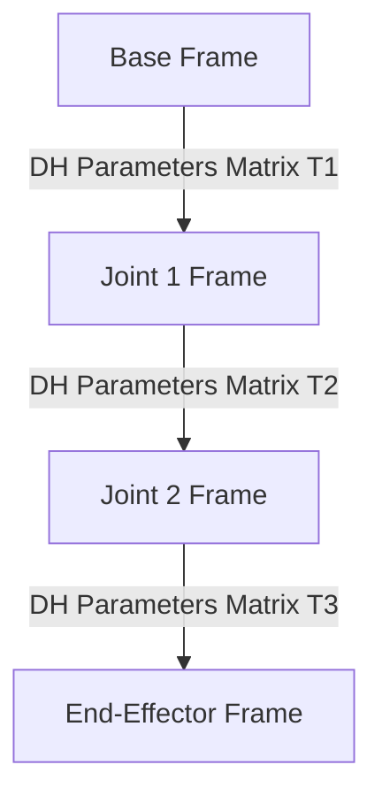

# Analytical Kinematics & Symbolic Era

## Concept Diagram

## Detailed Information

Analytical kinematics models physical interaction as an isolated, deterministic geometric problem. Engineers mathematically derive exact system profiles using Denavit-Hartenberg parameter matrices for robotic limbs, mapping absolute joint angles to target 3D spatial coordinates under perfect conditions. This era was characterized by precision but suffered from a lack of generalizability.

---
[Back to main README](../README.md)
