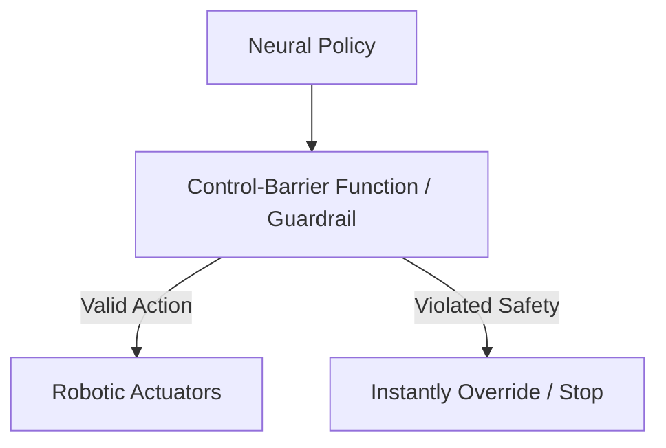

# The Covariance Shift & Physical Edge-Case Outlier Threat

## Concept Diagram

## Detailed Information

Covariance Shift refers to when a physical model encounters a minor environmental parameter unrepresented in its training data, causing output predictions to drift stochastically. Layering deterministic, low-level Control-Barrier Functions (CBFs) and hardcoded Safe-Invariance Guardrails overrides the neural policy.

---
[Back to main README](../README.md)
