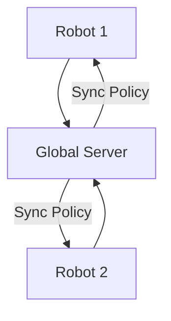

# Decentralized Real-World Fleet Exploration

## Concept Diagram

## Detailed Information

Decentralized Real-World Fleet Exploration operates via continuous online calibration. Dozens of autonomous physical machines run localized exploration loops concurrently, uploading their error metrics, grip slippages, and mechanical trajectory failures to a global server.

---
[Back to main README](../README.md)
