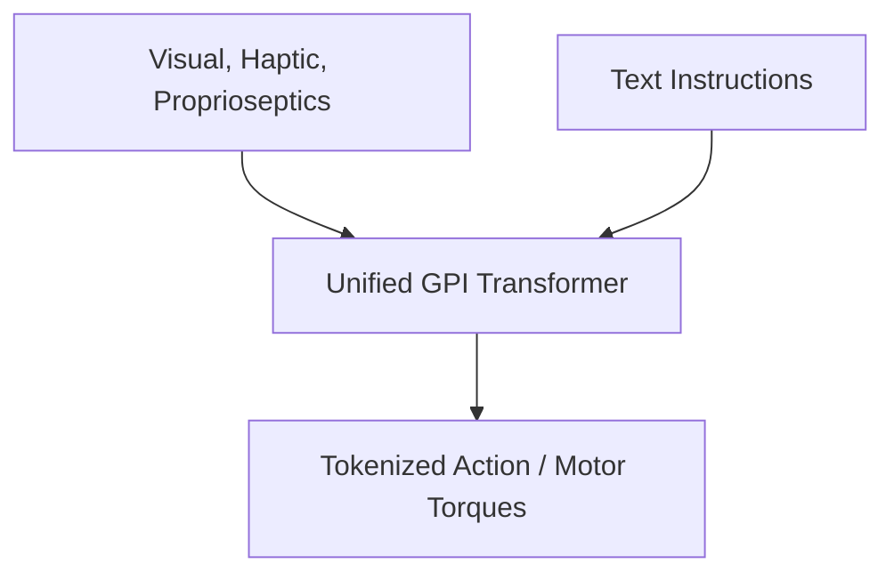

# Unified End-to-End Foundation GPI

## Concept Diagram

## Detailed Information

Unified End-to-End Foundation GPI represents the modern state-of-the-art paradigm driving advanced humanoid robotics and unified web-scale physical agents. GPI reframes physical interactions as a generative sequence modeling problem, combining Vision-Language-Action (VLA) models with large-scale multi-environment Reinforcement Learning (RL).

---
[Back to main README](../README.md)
