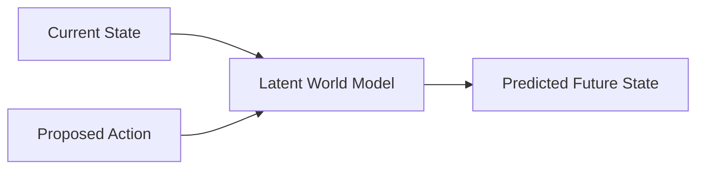

# Generative World Models for Physics Simulation

## Concept Diagram

## Detailed Information

Generative World Models use generative diffusion and flow-matching video architectures optimized to act as predictive simulators. By reading a robot's current kinetic state and proposed control inputs, the world model synthesizes a physically consistent future video rollout inside its hidden layers.

---
[Back to main README](../README.md)
