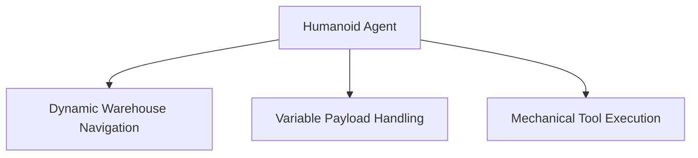

# Multi-Task Autonomous Humanoid Robotics & Logistics

## Concept Diagram

## Detailed Information

This application drives next-generation warehouse fulfillment and factory assembly lines. GPI humanoids operate completely un-tethered inside dynamic workspaces, moving across changing flooring setups, dynamically shifting their grip forces, and utilizing mechanical tools cleanly via natural language commands.

---
[Back to main README](../README.md)
