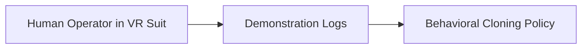

# Teleoperated Human Demonstrations (Imitation Learning)

## Concept Diagram

## Detailed Information

Teleoperated Human Demonstrations capture raw multi-modal sensor streams from human operators wearing specialized VR haptic suits or steering teleoperation rigs. The model clones the exact force distributions, spatial acceleration arcs, and semantic object-handling choices.

---
[Back to main README](../README.md)
