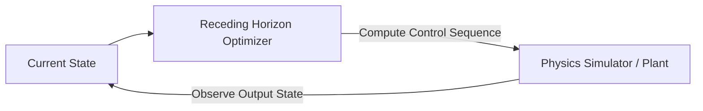

# Model Predictive Control & Trajectory Optimization

## Concept Diagram

## Detailed Information

Model Predictive Control (MPC) introduced continuous real-time optimization over short, finite future lookahead horizons. By continuously re-solving equations of motion online and reading tracking sensor updates, physical machines (such as bipedal humanoids or quadrupeds) adapted to dynamic perturbations, surface drops, and payload shifts on-the-fly.

---
[Back to main README](../README.md)
