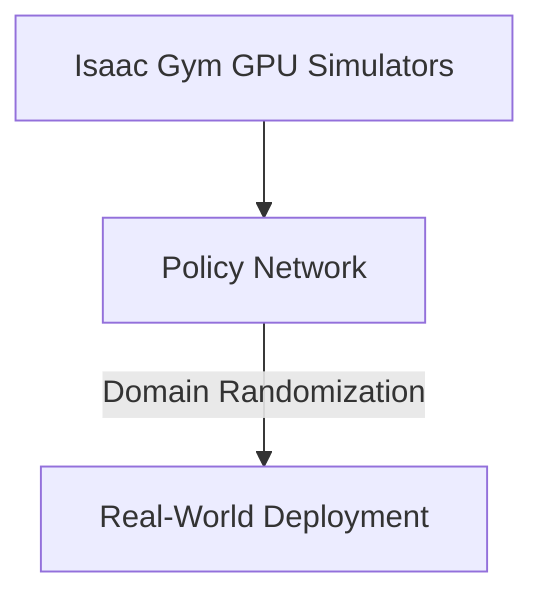

# Sim-to-Real Distributed Reinforcement Learning

## Concept Diagram

## Detailed Information

Sim-to-Real Distributed Reinforcement Learning utilizes high-velocity virtual training. It leverages parallel physics simulators operating entirely inside fast GPU arrays. The model runs millions of simultaneous trajectory simulations overnight, optimizing its policy across extreme terrain and collision parameters rapidly.

---
[Back to main README](../README.md)
