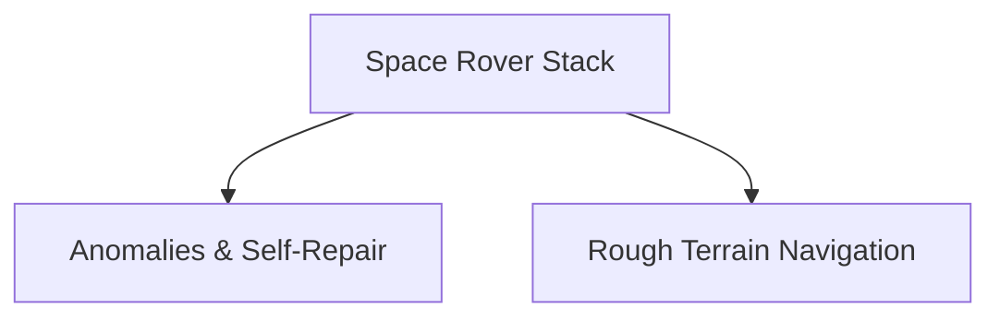

# Mission-Critical Space Exploration & Extraterrestrial Maintenance

## Concept Diagram

## Detailed Information

Deployed within remote planetary rovers, autonomous orbital docking systems, and deep-space habitats. Because communication delays prevent active human cloud control, local GPI world models allow the machine to autonomously reason through mechanical structural anomalies, compute safe exploration trajectories, and refactor equipment malfunctions safely.

---
[Back to main README](../README.md)
