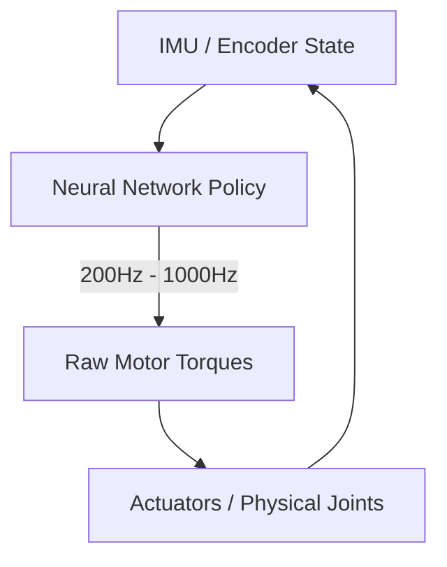

# Pure Tokenized Torque/Velocity Policies

## Concept Diagram

## Detailed Information

Pure Tokenized Torque/Velocity Policies bypass abstract position vectors, operating directly at the raw silicon-to-hardware boundary layer. The network processes raw joint encoder angles, IMU orientation data, and tactile force feedback grids, outputting precise electrical motor torque commands at high frequencies.

---
[Back to main README](../README.md)
