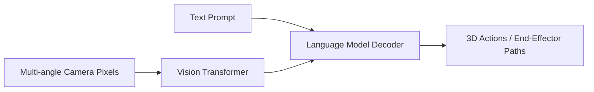

# Vision-Language-Action (VLA) Foundations

## Concept Diagram

## Detailed Information

Vision-Language-Action (VLA) foundations integrate high-resolution spatial Vision Transformers (ViTs) with textual command networks and kinetic output heads. The VLA read prompts, ingests multi-angle live video pixels, and outputs explicit 3D end-effector position vectors or normalized action primitives.

---
[Back to main README](../README.md)
